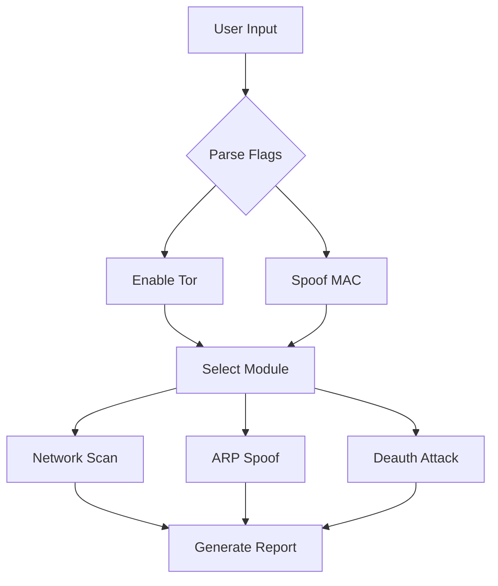

# ⚔️ net_attkr.sh: Network Penetration Toolkit for Raspberry Pi
# 🛡️ net-AttaKr-Stay-Anon: Network Penetration & Anonymity Framework

# net-AttaKr_Stay-Anon

`net-AttaKr_Stay-Anon` is a comprehensive toolkit designed for network penetration testing and maintaining anonymity. It includes tools for ARP spoofing, Wi-Fi attacks, packet analysis, and anonymity management. The scripts are modular and can be customized for specific use cases, making it suitable for ethical hacking and network security assessments.

## Features

- **Anonymity Management**: Enable, disable, and check anonymity using the Tor network and MAC address spoofing.
- **ARP Spoofing**: Intercept traffic between a target and gateway to analyze and manipulate network traffic.
- **Wi-Fi Attacks**: Perform deauthentication attacks and other Wi-Fi-based exploits.
- **Packet Analysis**: Capture and analyze network packets for detailed insights.
- **Network Scanning**: Identify live hosts, open ports, and network vulnerabilities.
- **Interactive Menu**: A user-friendly interface for selecting and executing various functionalities.
- **Command-Line Options**: Directly run modules with parameters for advanced use cases.

## Usage

### Interactive Mode

Run the script without arguments to launch the interactive menu:
```bash
./main.sh
```

### Command-Line Mode

You can also execute specific modules directly using command-line arguments:
```bash
./main.sh --module <module> [parameters]
./main.sh --anon <action>
```

#### Examples:

1. **Enable Anonymity**:
   ```bash
   ./main.sh --anon enable
   ```

2. **Perform a Network Scan**:
   ```bash
   ./main.sh --module scan --range 192.168.1.0/24 --stealth
   ```

3. **Start a MITM Attack**:
   ```bash
   ./main.sh --module mitm --interface eth0 --target 192.168.1.100 --gateway 192.168.1.1 --capture
   ```

## Installation

1. Clone the repository:
   ```bash
   git clone https://github.com/elithaxxor/net-AttaKr_Stay-Anon.git
   cd net-AttaKr_Stay-Anon/net_AttKr
   ```

2. Ensure the required tools are installed:
   - [`tcpdump`](https://www.tcpdump.org/)
   - [`airmon-ng`](https://www.aircrack-ng.org/)
   - [`arpspoof`](https://www.monkey.org/~dugsong/dsniff/)
   - [`macchanger`](https://linux.die.net/man/1/macchanger/)
   - [`torsocks`](https://manpages.ubuntu.com/manpages/bionic/man1/torsocks.1.html)

3. Run the script:
   ```bash
   ./main.sh
   ```

## Requirements

- Linux-based operating system
- Administrative privileges (`sudo`)
- Networking tools (e.g., `tcpdump`, `aircrack-ng`, `dsniff`)

## Disclaimer

This project is intended for educational purposes and ethical hacking only. Unauthorized use of these tools on networks without explicit permission is illegal and unethical. The developers are not responsible for any misuse of this software.

---

## Change Log

### [2025-04-16]
- **[Update mitm.sh](https://github.com/elithaxxor/net-AttaKr_Stay-Anon/commit/10c74a49bd32f343285922b171b4f28136bdcc8c)**: Refactored and updated MITM script.
- **[Create deauth.sh](https://github.com/elithaxxor/net-AttaKr_Stay-Anon/commit/aedc08de5858670d10640d971a5ebb30ed08264b)**: Added script for performing deauthentication attacks.
- **[Create wifi_attacks_0.sh](https://github.com/elithaxxor/net-AttaKr_Stay-Anon/commit/a51e53693b75c18414bb411a697171f0b276f370)**: Introduced new Wi-Fi attack functionalities.
- **[Create arp_spoof.sh](https://github.com/elithaxxor/net-AttaKr_Stay-Anon/commit/5054f8fc89cdf37a958fa0652e3e0c0020876cd5)**: Added ARP spoofing script.
- **[Create mitm.sh](https://github.com/elithaxxor/net-AttaKr_Stay-Anon/commit/2e0f5e97bf7d6220816259f7494d15ece68cbe74)**: Initial script for man-in-the-middle attacks.
- **[Create wifi-attacks.sh](https://github.com/elithaxxor/net-AttaKr_Stay-Anon/commit/849e3caa423c0e01d7c6a92f2682e7130e09e806)**: Added modular script for Wi-Fi attacks.
- **[Create packet-analysis.sh](https://github.com/elithaxxor/net-AttaKr_Stay-Anon/commit/897cd642017a3281aacb183014595a8a5c96d90e)**: Introduced packet analysis functionalities.
- **[Create anon-mode.sh](https://github.com/elithaxxor/net-AttaKr_Stay-Anon/commit/c7b9d3f94c1fb514f8d21689ce96a1c52cc99b1f)**: Added anonymity mode configuration script.
- **[Create check-anonymity.sh](https://github.com/elithaxxor/net-AttaKr_Stay-Anon/commit/bdf2d681cab44bdf4287737544c3116c08c390c3)**: Script to check Tor-based anonymity.
- **[Create scan.sh](https://github.com/elithaxxor/net-AttaKr_Stay-Anon/commit/cd2fb54e5e26b4b524aea5b0ab99ebbae41f6b2f)**: Added network scanning script.

---

For a full commit history, visit the [GitHub repository](https://github.com/elithaxxor/net-AttaKr_Stay-Anon/commits?per_page=100).
```

### Updates
- Added details about the new interactive and command-line execution modes.
- Updated the change log with the latest commits for the repository.

## 📋 Overview

**net-AttaKr-Stay-Anon** is a comprehensive collection of scripts and tools designed to perform network penetration testing, vulnerability assessment, and anonymity operations. Built with Raspberry Pi compatibility in mind, this toolkit transforms your device into a powerful security testing platform.

> ⚠️ **Ethical Use Notice**: This toolkit is intended for security professionals, researchers, and educational purposes only. Always obtain proper authorization before testing any network or system.
net-AttaKr_Stay-Anon

`net-AttaKr_Stay-Anon` is a suite of network penetration testing and anonymity tools designed for ethical hacking, network analysis, and security assessments. It includes scripts for ARP spoofing, WiFi attacks, packet analysis, and maintaining anonymity using the Tor network. Each script is modular and can be customized based on specific use cases.

## Features

- **ARP Spoofing**: Intercept network traffic between a target and a gateway.
- **WiFi Attacks**: Perform deauthentication attacks and WiFi-based exploits.
- **Packet Analysis**: Capture and analyze network packets.
- **Anonymity Tools**: Configure and maintain anonymity using Tor and MAC address spoofing.
- **Network Scanning**: Perform network scans for identifying live hosts and open ports.

## Usage

Each script in the repository is designed for a specific task. Below are some examples of the available scripts:

1. **ARP Spoofing**:
   ```bash
   ./arp_spoof.sh --interface eth0 --target 192.168.1.100 --gateway 192.168.1.1 --capture
   ```

2. **WiFi Attacks**:
   ```bash
   ./deauth.sh --interface wlan0 --bssid XX:XX:XX:XX:XX:XX --client YY:YY:YY:YY:YY:YY
   ```

3. **Anonymity Tools**:
   ```bash
   ./anon-mode.sh --enable
   ./anon-mode.sh --disable
   ```

4. **Network Scanning**:
   ```bash
   ./scan.sh --range 192.168.1.0/24
   ```

5. **Packet Analysis**:
   ```bash
   ./packet-analysis.sh --interface eth0
   ```

## Installation

Clone the repository and navigate to the script directory:
```bash
git clone https://github.com/elithaxxor/net-AttaKr_Stay-Anon.git
cd net-AttaKr_Stay-Anon/net_AttKr
```

Ensure the required tools are installed on your system:
- [`tcpdump`](https://www.tcpdump.org/)
- [`airmon-ng`](https://www.aircrack-ng.org/)
- [`arpspoof`](https://www.monkey.org/~dugsong/dsniff/)
- [`macchanger`](https://linux.die.net/man/1/macchanger)
- [`torsocks`](https://manpages.ubuntu.com/manpages/bionic/man1/torsocks.1.html)

## Requirements

- Linux-based operating system
- Administrative privileges (`sudo` access)
- Networking tools (e.g., `tcpdump`, `aircrack-ng`, `dsniff`)

## Disclaimer

This project is intended for educational purposes and ethical hacking only. Unauthorized use of these tools on networks without explicit permission is illegal and unethical. The developers are not responsible for any misuse of this software.

---

## Change Log

### [2025-04-16]
- **[Update mitm.sh](https://github.com/elithaxxor/net-AttaKr_Stay-Anon/commit/10c74a49bd32f343285922b171b4f28136bdcc8c)**: Refactored and updated MITM script.
- **[Create deauth.sh](https://github.com/elithaxxor/net-AttaKr_Stay-Anon/commit/aedc08de5858670d10640d971a5ebb30ed08264b)**: Added script for performing deauthentication attacks.
- **[Create wifi_attacks_0.sh](https://github.com/elithaxxor/net-AttaKr_Stay-Anon/commit/a51e53693b75c18414bb411a697171f0b276f370)**: Introduced new WiFi attack functionalities.
- **[Create arp_spoof.sh](https://github.com/elithaxxor/net-AttaKr_Stay-Anon/commit/5054f8fc89cdf37a958fa0652e3e0c0020876cd5)**: Added ARP spoofing script.
- **[Create mitm.sh](https://github.com/elithaxxor/net-AttaKr_Stay-Anon/commit/2e0f5e97bf7d6220816259f7494d15ece68cbe74)**: Initial script for man-in-the-middle attacks.
- **[Create wifi-attacks.sh](https://github.com/elithaxxor/net-AttaKr_Stay-Anon/commit/849e3caa423c0e01d7c6a92f2682e7130e09e806)**: Added modular script for WiFi attacks.
- **[Create packet-analysis.sh](https://github.com/elithaxxor/net-AttaKr_Stay-Anon/commit/897cd642017a3281aacb183014595a8a5c96d90e)**: Introduced packet analysis functionalities.
- **[Create anon-mode.sh](https://github.com/elithaxxor/net-AttaKr_Stay-Anon/commit/c7b9d3f94c1fb514f8d21689ce96a1c52cc99b1f)**: Added anonymity mode configuration script.
- **[Create check-anonymity.sh](https://github.com/elithaxxor/net-AttaKr_Stay-Anon/commit/bdf2d681cab44bdf4287737544c3116c08c390c3)**: Script to check Tor-based anonymity.
- **[Create scan.sh](https://github.com/elithaxxor/net-AttaKr_Stay-Anon/commit/cd2fb54e5e26b4b524aea5b0ab99ebbae41f6b2f)**: Network scanning script for identifying live hosts.

---

For a full commit history, visit the [GitHub repository](https://github.com/elithaxxor/net-AttaKr_Stay-Anon/commits?per_page=100).
```

---

## 🌟 Features

### 🕵️‍♂️ Network Intelligence
- **🔍 Silent Reconnaissance**: Passive network mapping and device enumeration.
- **📊 Traffic Analysis**: Deep packet inspection with protocol breakdown.
- **🔎 Vulnerability Scanning**: Identify weaknesses in network infrastructure.

### ⚔️ Attack Vectors
- **🌐 ARP Spoofing**: Man-in-the-middle capability for intercepting unencrypted traffic.
- **📡 Deauthentication**: Targeted and broadcast Wi-Fi disruption (802.11 protocol testing).
- **🔑 Credential Harvesting**: Extract login information from unencrypted protocols.

### 🕶️ Anonymity Protection
- **🧅 Tor Integration**: Route all attack traffic through the Tor network.
- **🔄 MAC Address Manipulation**: Automated hardware address cycling.
- **🛑 Killswitch Mechanisms**: Auto-terminate connections if anonymity is compromised.

---

## 💻 Installation

### System Requirements
- Raspberry Pi 3/4/5 (or similar ARM-based device)
- Kali Linux (recommended) or Raspberry Pi OS
- External Wi-Fi adapter with monitor mode capability
- 16GB+ microSD card

### Quick Setup

```bash
# Clone the repository
git clone https://github.com/elithaxxor/net-AttaKr-Stay-Anon.git
cd net-AttaKr-Stay-Anon

# Install dependencies
sudo ./setup.sh

# Configure anonymization features
sudo ./configure-anonymity.sh
```

---

## 🚀 Quick Start Guide

### 🔄 Preparing Your Environment

1. **Connect Your Pi**: Set up wired internet or a separate Wi-Fi connection.
2. **Enable Anonymity Mode**:
   ```bash
   sudo ./anon-mode.sh --enable
   ```
3. **Verify Protection**:
   ```bash
   ./check-anonymity.sh
   ```
   
### 🎯 Basic Reconnaissance Example

```bash
# Scan local network silently
sudo ./net_AttKr/scan.sh --stealth --range 192.168.1.0/24

# Output example:
# 🔍 Discovered devices:
# 📱 192.168.1.5  |  Apple iPhone  |  Last seen: 2 mins ago
# 💻 192.168.1.10 |  Windows PC   |  Services: SMB, HTTP
# 🖨️ 192.168.1.15 |  HP Printer   |  Ports: 80, 443, 9100
```

### 🔄 Traffic Interception (Basic MITM)

```bash
# Start ARP spoofing between target and gateway
sudo ./net_AttKr/mitm.sh --target 192.168.1.5 --gateway 192.168.1.1 --capture
```

---

## 📚 Module Breakdown

| Module | Description | Example Usage |
|--------|-------------|--------------|
| **🔍 scan.sh** | Network discovery & enumeration | `sudo ./scan.sh --range 192.168.1.0/24` |
| **🔄 mitm.sh** | Traffic interception & manipulation | `sudo ./mitm.sh --target 192.168.1.5` |
| **📡 wifi-attacks.sh** | 802.11 protocol testing suite | `sudo ./wifi-attacks.sh --deauth` |
| **📊 packet-analysis.sh** | Live traffic monitoring & logging | `sudo ./packet-analysis.sh --interface eth0` |
| **🛡️ anonymity.sh** | Tor routing & identity protection | `sudo ./anonymity.sh --rotate-identity 30` |

---

## 🖼️ Preview

Here's what you can expect to see when running our tools:

### Network Scan Visualization
```
Network Topology Map:
    Router (192.168.1.1)
         │
    ┌────┴───────┐
    │            │
 Smart TV     Windows PC
(192.168.1.2)  (192.168.1.3)
```

### Traffic Capture Interface
```
🔴 LIVE CAPTURE: eth0 🔴
━━━━━━━━━━━━━━━━━━━━━━━━━━━━━━━━
IP: 192.168.1.5 → 8.8.8.8 | DNS Query: facebook.com
IP: 192.168.1.3 → 192.168.1.1 | HTTP GET: /router_admin.html
IP: 192.168.1.10 → 192.168.1.15 | SMB: \\PRINTER\documents\resume.pdf
━━━━━━━━━━━━━━━━━━━━━━━━━━━━━━━━
```

---

## 🛠️ Advanced Configuration

### Customizing Attack Parameters

Edit the `config/attack-profiles.json` file to define common attack patterns:

```json
{
  "profile": "home-network",
  "scan": {
    "timeout": 0.5,
    "ports": [22, 80, 443, 8080]
  },
  "mitm": {
    "interval": 5,
    "protocols": ["http", "dns"]
  }
}
```

### Scheduling Automated Operations

Use the built-in scheduler for time-based operations:

```bash
# Run reconnaissance every 30 minutes, store results
sudo ./scheduler.sh --task "scan.sh --stealth" --interval 30m --output results/
```

---

## 🔧 Troubleshooting

### Common Issues

#### ❓ "Permission denied" errors
```bash
# Fix permissions
sudo chown -R $(whoami) ./net_AttKr
chmod +x ./net_AttKr/*.sh
```

#### ❓ Wireless adapter not entering monitor mode
```bash
# Check compatibility and enable manually
sudo airmon-ng check kill
sudo ip link set wlan0 down
sudo iwconfig wlan0 mode monitor
sudo ip link set wlan0 up
```

#### ❓ Tor connection failing
```bash
# Verify Tor service is running
sudo systemctl restart tor
./check-anonymity.sh --verbose
```

---

## 📝 Documentation

Detailed documentation is available for each module:

- [Complete Attack Framework Guide](docs/ATTACK_FRAMEWORK.md)
- [Anonymity Best Practices](docs/ANONYMITY.md)
- [Custom Module Development](docs/DEVELOPMENT.md)

---

## 🤝 Contributing

We welcome contributions! Here's how you can help:

1. **Fork** the repository
2. **Create** a feature branch (`git checkout -b feature/amazing-tool`)
3. **Commit** your changes (`git commit -m 'Add amazing new tool'`)
4. **Push** to your branch (`git push origin feature/amazing-tool`)
5. Create a **Pull Request**

For major changes, please open an issue first to discuss proposed modifications.

---

## 📊 Project Status

| Module | Status | Last Updated |
|--------|--------|--------------|
| Network Scanner | ✅ Complete | 2023-10-15 |
| MITM Framework | ✅ Complete | 2023-11-05 |
| Wi-Fi Attacks | ⚠️ In Progress | 2023-12-10 |
| Anonymity Suite | ✅ Complete | 2023-10-20 |
| Vulnerability Scanner | 🚧 Under Development | - |

---

<div>  
<p align="center">

## ⚠️ Legal Disclaimer

This toolkit is provided for **educational and authorized testing purposes ONLY**. Unauthorized access to computer systems and networks is illegal and unethical. Users are responsible for complying with applicable laws and regulations.

**The developers assume NO LIABILITY** for misuse or damage caused by this software.
</p>

</div>


---

## 📦 Script Architecture



---

## 🎨 ASCII Art Visualization

```
    NETWORK MODES
   +---------------+
   | 1. SCAN       |             Pi@192.168.1.100
   | 2. SPOOF      |        +-----------------------+
   | 3. DEAUTH     <=======>|    [TOR PROXY]        |
   +---------------+        +-----------------------+
                                |            |
                          [Wi-Fi Adapter]  [Eth Cable]
```

---

## ⚠️ Legal & Ethical Warning

- **Educational Use Only**: Never attack networks without explicit permission.
- **Anonymity Limits**: Tor doesn't make you invincible – combine with VPNs.
- **Karma Clause**: Script may fail if used for black-hat activities 😉

---

## 🚨 Troubleshooting

### Common Issues
- **Permission Denied**: Always run with `sudo`.
- **Wi-Fi Not in Monitor Mode**:
  ```bash
  sudo airmon-ng start wlan0
  ```
- **Tor Not Connecting**: Check `/var/log/tor.log` for errors.

---

## 🤝 Contributing

1. **Fork the Repository**
2. **Create a Branch**:
   ```bash
   git checkout -b feature/brilliant-idea
   ```
3. **Test & Commit**:
   ```bash
   sudo ./net_attkr.sh --test-your-feature && git commit -m "Added brilliant idea"
   ```
4. **Open a Pull Request**

---

## 📜 License: copyleft 

<p align="center">
⚠️ Disclaimer

This tool is intended for security professionals to perform authorized security assessments only. Unauthorized scanning of networks may violate local, state, and federal laws. The author is not responsible for misuse or damage caused by this tool.

@copyleft my mistakes yours. feel free to incorporate it into your work. however, I'm not responsible for your actions. do not be unethical. do not harm others. do the right thing.
</p>

</div>


-------------------------------------------------------------

## Changelogs + additional usage

``` 

---

### Customization Tips:
1. **Replace Placeholders**: Add your actual banner image, PGP key, and contact email.
2. **Add Screenshots**: Include terminal recordings or output samples.
3. **Expand Modules**: If the script has more features, add sections like `--exploit` or `--decrypt`.
4. **Localize Warnings**: Adjust humor/legal text to match your audience’s culture.

This README balances professionalism with approachability – perfect for attracting both experts and curious tinkerers! 🔍

---

### **Key Functionalities**
1. **Main Menu**:
   - Displays a menu with options to:
     1. Set up network monitoring.
     2. Configure IP management tools.
     3. Configure proxy chains.
     4. Run security tools.
     5. Exit the script.

   - Based on the user's choice, the script navigates to the respective module.

2. **Setup Network Monitoring**:
# Color definitions
GREEN=$(tput setaf 2)
YELLOW=$(tput seta
   - Lists connected USB devices using `lsusb`.
   - Checks for conflicting processes with `airmon-ng` and kills them.
   - Activates monitor mode on available network interfaces using `airmon-ng`.
   - Displays wireless network configuration using `iwconfig`.
   - Optionally configures Bluetooth devices using `hciconfig`.
   - Restarts the `NetworkManager` service.
# Color definitions
GREEN=$(tput setaf 2)
YELLOW=$(tput seta

# Color definitions
GREEN=$(tput setaf 2)
YELLOW=$(tput seta
3. **IP Management Configuration**:
   - Allows the user to install and configure one of the following IP management tools:
     - **phpIPAM**: A web-based IP address management tool.
     - **NetBox**: A tool for managing network infrastructure and IP addresses.
     - **GestióIP**: A similar IP management tool.
     - **TeemIp**: Another IP management solution.
# Color definitions
GREEN=$(tput setaf 2)
YELLOW=$(tput seta

   - The script installs necessary dependencies (e.g., Apache, MariaDB, PHP) and configures databases for these tools.

4. **Proxychains Configuration**:
   - Allows the user to configure `proxychains` to route traffic through proxies.
   - Displays the current proxychains configuration.
   - Prompts the user to select a proxy type (HTTP, SOCKS4, SOCKS5) and enter proxy IP and port.
   - Updates the `proxychains` configuration file to include the new proxy settings.

5. **Run Security Tools**:
   - Provides options to:
     1. Run a network scanner using `nmap` to scan a specific network range.
     2. Run a vulnerability scanner using tools like OpenVAS.
     3. Start an anonymization suite by launching the Tor service and routing browser traffic through Tor using `proxychains`.

6. **Initialization**:
   - Ensures the script is executed with root privileges.
   - Prompts the user to set a database password, which is stored temporarily for use in IP management tool configurations.

---

### **Features and Enhancements in the Script**
1. **Interactive User Prompts**:
   - The script is interactive, requiring user inputs for menu navigation and configuration settings.

2. **Tool Integration**:
   - Includes integration with various tools like:
     - `airmon-ng` for network monitoring.
     - `phpIPAM`, `NetBox`, `GestióIP`, and `TeemIp` for IP management.
# Color definitions
GREEN=$(tput setaf 2)
YELLOW=$(tput seta
     - `proxychains` for proxy configuration.
     - `nmap` and OpenVAS for security scanning.

3. **Automation**:
   - Automates the installation and configuration of dependencies and tools.
   - Uses database commands to set up databases for IP management tools.

4. **Color-Coded Output**:
   - Uses ANSI color codes to improve readability and provide visual cues for success, warnings, and errors.

5. **Warnings and Notices**:
   - Displays warnings to ensure tools are used only on authorized networks.

---

### **Issues in the Script**
# Color definitions
GREEN=$(tput setaf 2)
YELLOW=$(tput seta
- There are duplicate sections and inconsistent formatting (e.g., repeated prompts for proxy IP and port).
- Some placeholder comments like "I will update this section soon" suggest incomplete functionality.
- The script lacks error handling for failed commands.
- Sensitive information, like the database password, is exported as an environment variable, which could be a security risk.

---

### **Target Audience**
This script is intended for network administrators or security professionals who need to set up and manage network tools, monitor networks, configure proxies, and run security scans on their infrastructure.
