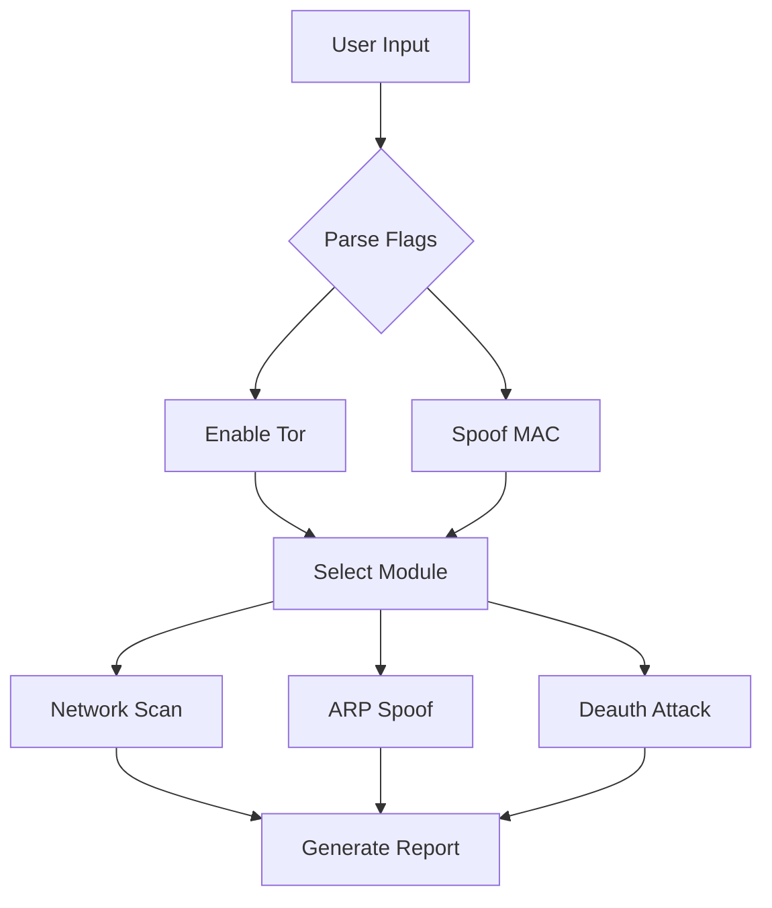

```markdown
# ⚔️ net_attkr.sh: Network Penetration Toolkit for Raspberry Pi

 <!-- Replace with your banner image -->

**net_attkr.sh** is a powerful Bash script designed for **Raspberry Pi** devices to perform ethical network penetration testing, vulnerability assessments, and anonymity operations. Ideal for red teamers and cybersecurity enthusiasts, this tool turns your Pi into a compact attack/defense node.

---

## 🌟 Key Features

### 🕵️ Anonymity First
- **🌐 Tor Network Integration**: Route all traffic through Tor for untraceable operations.
- **🔄 MAC Address Randomization**: Spoof device identity on every reboot.
- **📡 DNS Leak Protection**: Ensure no DNS requests expose your real IP.

### ⚡ Offensive Capabilities
- **ARP Spoofing**: Hijack local network traffic for MITM attacks.
- **📶 Wi-Fi Deauth**: Force devices to disconnect from networks (requires monitor mode).
- **🔑 Credential Sniffing**: Capture plaintext credentials on unsecured protocols.

### 📊 Reconnaissance Tools
- **Network Scanner**: Discover live hosts and open ports.
- **Service Fingerprinter**: Identify OS and software versions via banner grabbing.
- **Traffic Analyzer**: Export packet captures to PCAP for Wireshark analysis.

---

## 🛠️ Installation Guide

### Prerequisites
- **Raspberry Pi** (Model 3B+ or newer recommended)
- **Kali Linux ARM** or **Raspberry Pi OS** (with kernel headers)
- Root access (`sudo` privileges)

### Step 1: Clone the Repository
```bash
git clone https://github.com/elithaxxor/net-AttaKr-Stay-Anon.git
cd net-AttaKr-Stay-Anon/net_AttKr/
```

### Step 2: Install Dependencies
```bash
sudo apt update && sudo apt install -y \
  tor macchanger nmap tcpdump aircrack-ng \
  dsniff python3-scapy
```

### Step 3: Make Script Executable
```bash
chmod +x net_attkr.sh
```

---

## 🖥️ Usage Examples

### Basic Network Scan (Stealth Mode)
```bash
sudo ./net_attkr.sh --scan --target 192.168.1.0/24 --tor
```
**Output**:
```
🌐 Scanning 192.168.1.0/24 via Tor...
✅ Found 8 active hosts
📡 Open ports on 192.168.1.5: 22 (SSH), 80 (HTTP)
```

### Wi-Fi Deauthentication Attack
```bash
sudo ./net_attkr.sh --deauth \
  --interface wlan0 \
  --bssid 00:11:22:33:44:55 \
  --channel 6 \
  --duration 60
```
**Effect**: Disconnects all devices from target Wi-Fi for 60 seconds.

---

## 📦 Script Architecture



---

## 🎨 ASCII Art Visualization

```
    NETWORK MODES
   +---------------+
   | 1. SCAN       |             Pi@192.168.1.100
   | 2. SPOOF      |        +-----------------------+
   | 3. DEAUTH     <=======>|    [TOR PROXY]        |
   +---------------+        +-----------------------+
                                |            |
                          [Wi-Fi Adapter]  [Eth Cable]
```

---

## ⚠️ Legal & Ethical Warning

- **Educational Use Only**: Never attack networks without explicit permission.
- **Anonymity Limits**: Tor doesn't make you invincible – combine with VPNs.
- **Karma Clause**: Script may fail if used for black-hat activities 😉

---

## 🚨 Troubleshooting

### Common Issues
- **Permission Denied**: Always run with `sudo`.
- **Wi-Fi Not in Monitor Mode**:
  ```bash
  sudo airmon-ng start wlan0
  ```
- **Tor Not Connecting**: Check `/var/log/tor.log` for errors.

---

## 🤝 Contributing

1. **Fork the Repository**
2. **Create a Branch**:
   ```bash
   git checkout -b feature/brilliant-idea
   ```
3. **Test & Commit**:
   ```bash
   sudo ./net_attkr.sh --test-your-feature && git commit -m "Added brilliant idea"
   ```
4. **Open a Pull Request**

---

## 📜 License: copyleft 

<p align="center">
⚠️ Disclaimer

This tool is intended for security professionals to perform authorized security assessments only. Unauthorized scanning of networks may violate local, state, and federal laws. The author is not responsible for misuse or damage caused by this tool.

@copyleft my mistakes yours. feel free to incorporate it into your work. however, I'm not responsible for your actions. do not be unethical. do not harm others. do the right thing.
</p>

</div>


``` 

---

### Customization Tips:
1. **Replace Placeholders**: Add your actual banner image, PGP key, and contact email.
2. **Add Screenshots**: Include terminal recordings or output samples.
3. **Expand Modules**: If the script has more features, add sections like `--exploit` or `--decrypt`.
4. **Localize Warnings**: Adjust humor/legal text to match your audience’s culture.

This README balances professionalism with approachability – perfect for attracting both experts and curious tinkerers! 🔍

---

### **Key Functionalities**
1. **Main Menu**:
   - Displays a menu with options to:
     1. Set up network monitoring.
     2. Configure IP management tools.
     3. Configure proxy chains.
     4. Run security tools.
     5. Exit the script.

   - Based on the user's choice, the script navigates to the respective module.

2. **Setup Network Monitoring**:
# Color definitions
GREEN=$(tput setaf 2)
YELLOW=$(tput seta
   - Lists connected USB devices using `lsusb`.
   - Checks for conflicting processes with `airmon-ng` and kills them.
   - Activates monitor mode on available network interfaces using `airmon-ng`.
   - Displays wireless network configuration using `iwconfig`.
   - Optionally configures Bluetooth devices using `hciconfig`.
   - Restarts the `NetworkManager` service.
# Color definitions
GREEN=$(tput setaf 2)
YELLOW=$(tput seta

# Color definitions
GREEN=$(tput setaf 2)
YELLOW=$(tput seta
3. **IP Management Configuration**:
   - Allows the user to install and configure one of the following IP management tools:
     - **phpIPAM**: A web-based IP address management tool.
     - **NetBox**: A tool for managing network infrastructure and IP addresses.
     - **GestióIP**: A similar IP management tool.
     - **TeemIp**: Another IP management solution.
# Color definitions
GREEN=$(tput setaf 2)
YELLOW=$(tput seta

   - The script installs necessary dependencies (e.g., Apache, MariaDB, PHP) and configures databases for these tools.

4. **Proxychains Configuration**:
   - Allows the user to configure `proxychains` to route traffic through proxies.
   - Displays the current proxychains configuration.
   - Prompts the user to select a proxy type (HTTP, SOCKS4, SOCKS5) and enter proxy IP and port.
   - Updates the `proxychains` configuration file to include the new proxy settings.

5. **Run Security Tools**:
   - Provides options to:
     1. Run a network scanner using `nmap` to scan a specific network range.
     2. Run a vulnerability scanner using tools like OpenVAS.
     3. Start an anonymization suite by launching the Tor service and routing browser traffic through Tor using `proxychains`.

6. **Initialization**:
   - Ensures the script is executed with root privileges.
   - Prompts the user to set a database password, which is stored temporarily for use in IP management tool configurations.

---

### **Features and Enhancements in the Script**
1. **Interactive User Prompts**:
   - The script is interactive, requiring user inputs for menu navigation and configuration settings.

2. **Tool Integration**:
   - Includes integration with various tools like:
     - `airmon-ng` for network monitoring.
     - `phpIPAM`, `NetBox`, `GestióIP`, and `TeemIp` for IP management.
# Color definitions
GREEN=$(tput setaf 2)
YELLOW=$(tput seta
     - `proxychains` for proxy configuration.
     - `nmap` and OpenVAS for security scanning.

3. **Automation**:
   - Automates the installation and configuration of dependencies and tools.
   - Uses database commands to set up databases for IP management tools.

4. **Color-Coded Output**:
   - Uses ANSI color codes to improve readability and provide visual cues for success, warnings, and errors.

5. **Warnings and Notices**:
   - Displays warnings to ensure tools are used only on authorized networks.

---

### **Issues in the Script**
# Color definitions
GREEN=$(tput setaf 2)
YELLOW=$(tput seta
- There are duplicate sections and inconsistent formatting (e.g., repeated prompts for proxy IP and port).
- Some placeholder comments like "I will update this section soon" suggest incomplete functionality.
- The script lacks error handling for failed commands.
- Sensitive information, like the database password, is exported as an environment variable, which could be a security risk.

---

### **Target Audience**
This script is intended for network administrators or security professionals who need to set up and manage network tools, monitor networks, configure proxies, and run security scans on their infrastructure.
